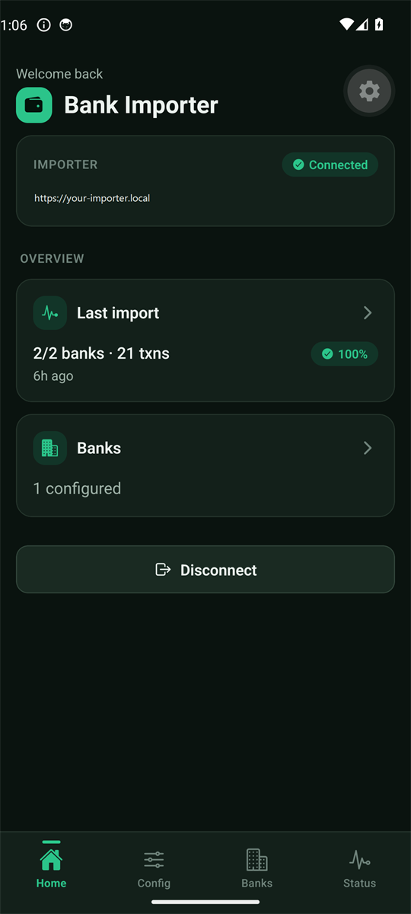
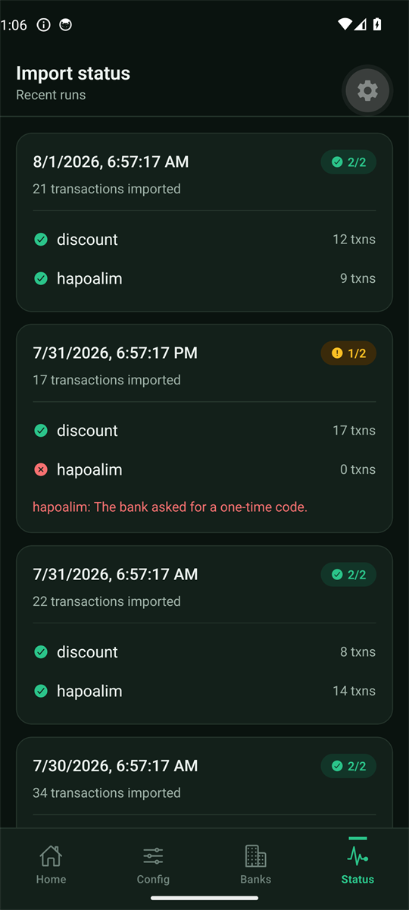
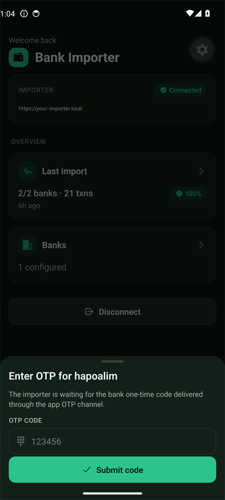
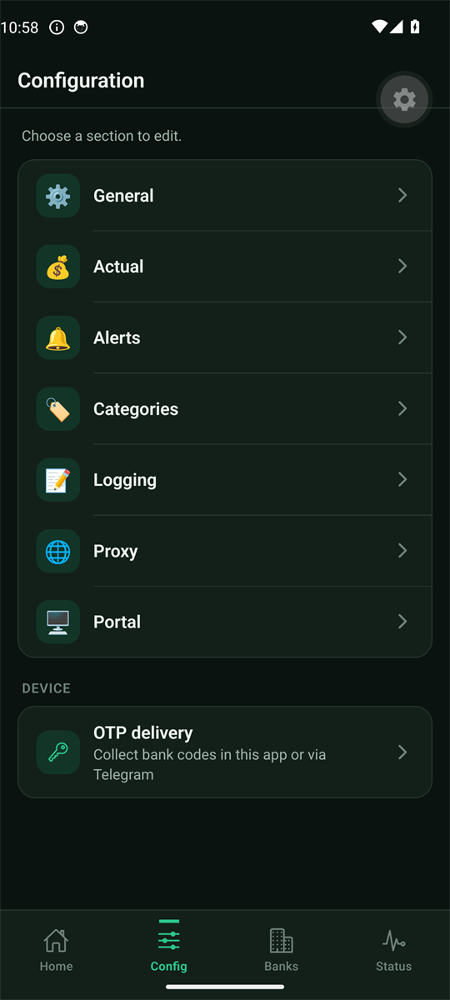
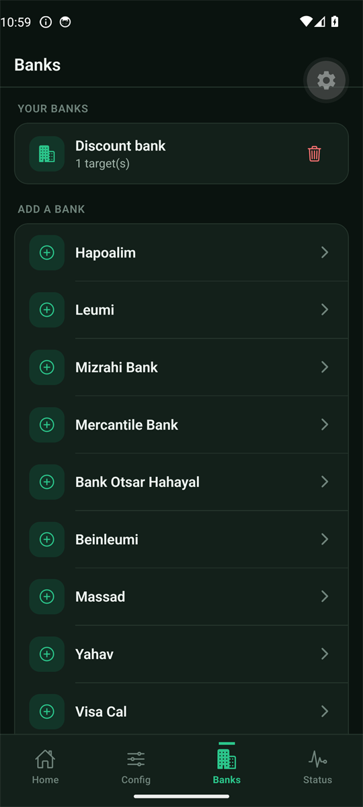
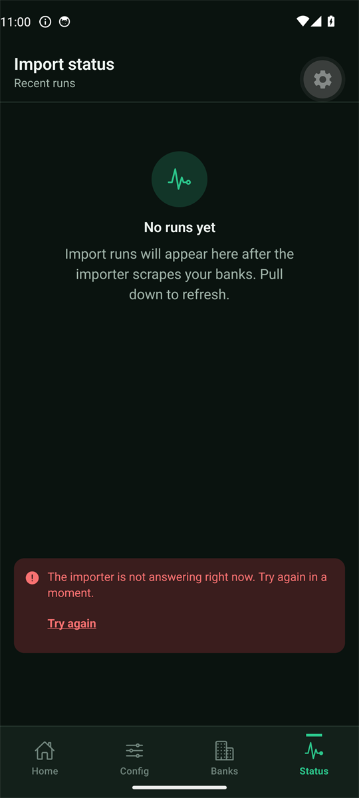

# Israeli Bank Importer — Mobile Config App

[](https://github.com/sergienko4/israeli-bank-importer-app/actions/workflows/ci.yml)
[](https://scorecard.dev/viewer/?uri=github.com/sergienko4/israeli-bank-importer-app)
[](LICENSE)

| Home | Import status | Bank one-time code |
| --- | --- | --- |
|  |  |  |

| Configuration | Banks | A failure that stays in view |
| --- | --- | --- |
|  |  |  |

A cross-platform **Expo / React Native** app (iOS + Android) that lets you edit
your **self-hosted [Israeli Bank Importer](https://github.com/sergienko4/israeli-bank-scrapers-to-actual-budget)**
configuration from your phone — without SSHing into a server or hand-editing
`config.json`.

The app is a **thin, manifest-driven client**: it talks to *your own* importer's
config portal API over a **private network**, so your bank credentials never
leave your machine and never touch a third-party cloud.

> **Companion backend:** this app configures the self-hosted
> [**israeli-bank-scrapers-to-actual-budget**](https://github.com/sergienko4/israeli-bank-scrapers-to-actual-budget)
> importer — the server that scrapes your banks and imports into
> [Actual Budget](https://actualbudget.org/). You need that importer running
> (with its config portal enabled) to use this app.

## How it works

```text
 ┌─────────────┐   Authorization: Bearer   ┌────────────────────────────┐
 │  This app   │ ──────── private network ─▶ │  Your self-hosted importer │
 │ (phone)     │        (Tailscale / VPN)   │  portal API  /api/*        │
 └─────────────┘ ←────── manifest + config ─ └────────────────────────────┘
```

- The importer already exposes a **manifest-driven** portal API
  (`/api/manifest`, `/api/config`, `/api/banks/:name`, `/api/validate`).
- The importer supports **browser sign-in for apps** (`/auth/app/authorize` →
  `/auth/app/token`) — this app uses it, so the portal password is never typed
  into the app.
- You reach your importer over a **private tunnel** (Tailscale recommended); the
  credential-editing API is never exposed to the public internet.
- Optionally acts as the importer's **OTP channel**: when a bank needs a
  one-time code, the importer prompts *this app* instead of Telegram, and you
  approve the code on your phone. See
  [OTP delivery](https://github.com/sergienko4/israeli-bank-scrapers-to-actual-budget/blob/main/docs/OTP-AUTOFORWARD.md#alternative-native-app-otp-no-telegram).

## Requirements

- **Node.js 22+** and the [Expo](https://docs.expo.dev/) toolchain (`npx expo`).
- A **running importer** (v1.41.0+) with the config portal enabled, app sign-in
  turned on (`portal.app.enabled`), and reachable from your phone over a private
  network.
- For device builds: an **Expo account** (`EXPO_TOKEN`) and, to publish, Apple
  ($99/yr) and/or Google Play ($25) developer accounts.

## Signing in

1. Enter your importer's address and tap **Sign in**.
2. Your phone's browser opens **your importer's own login page**. Complete
   whatever it asks for — Google, a password, or both.
3. The browser hands control back to the app, which receives a token pair.

The app never sees your portal password, and it does not store one. What it
keeps is a refresh token in the device secure store (iOS Keychain / Android
Keystore). That token only works against this one importer, it is replaced every
time it is used, and you can end it at any time from the portal's app-sessions
list — the next renewal on that device then fails and the app returns to the
sign-in screen.

Renewal is guarded by Face ID / fingerprint. A device with no screen lock cannot
protect a long-lived token, so on those devices the app signs out rather than
renewing silently.

Upgrading from an older version deletes the portal password it used to store.

## Bank one-time codes

When a bank asks for a one-time code, the importer prompts this app and you
approve the code on your phone. Getting the code out of an SMS and into the
prompt is the slow part, so the app helps with it — carefully, because the cost
of submitting a wrong code is a bank-side attempt, and those run out.

- **The keyboard offers it.** The code field is marked as a one-time-code field,
  so iOS and Android suggest the code above the keyboard. Nothing is read; the
  OS does the work and you tap.
- **Android can read the message, once, with no permission at all.** If a
  candidate message arrives while the prompt is open, Android shows *its own*
  dialog asking whether this app may read that one message. Approve it and the
  code fills itself. This path holds no SMS permission whatsoever and cannot
  reach anything you did not just approve. Decline, ignore it, or run a device
  without Play Services, and you simply type the code as before.
- **Auto-submit is off until you turn it on.** In **OTP settings** you can let a
  filled code send itself. It then sends after a three-second countdown you can
  cancel, at most once per request.
- **Zero-touch capture is off until you turn it on.** Also in **OTP settings**,
  and the only part of any of this that involves an SMS permission — see below.

### Zero-touch capture

Everything above still needs the app to be on screen. Turning on **auto-read**
in OTP settings removes that: Android asks for `RECEIVE_SMS`, and once you grant
it a code can be captured and submitted while the phone is in your pocket and
the app is closed — no dialog, no tap.

That is a different privacy bargain, so it is worth being plain about what
installing the app does and does not do on its own:

- The released build **declares** `RECEIVE_SMS`, so you will see it listed among
  the app's permissions before you have agreed to anything. Declaring is not
  holding: it is a runtime permission, nothing is granted until you turn the
  switch on and approve Android's dialog, and until then the receiver is inert.
- Turning either switch back off stops the app acting on messages, and erases
  everything being held in the same write. The Android grant itself outlives the
  switch — the app cannot hand a permission back, so it stays listed as granted
  until you remove it in Android's app settings. What changes is that the
  receiver goes inert again and keeps nothing.
- The receiver ignores every message unless you have opted in. One it does act
  on is submitted only when the importer is actually waiting for a code and the
  message yields exactly one; one that yields none, or two that disagree, is
  dropped. Nothing else is kept.
- `READ_SMS` is blocked outright in every build, so none of this can reach your
  message history — only messages arriving while the app is installed, paired
  and switched on.
- Building with `OTP_SMS_AUTOREAD=0` leaves the permission, the receiver and the
  service out of the APK altogether, for anyone who would rather they were not
  there to switch on. That build is otherwise identical.

**A code that arrives before the importer asks is held, not lost.** Banks often
send the code first, and Android delivers that broadcast exactly once. Rather
than drop it, the receiver keeps the message — raw and unparsed — and the app
spends it the moment a matching request appears. Nothing is read from your
inbox to do this: the app still holds `RECEIVE_SMS` and not `READ_SMS`, so the
only messages it can hold are ones that arrived while it was installed, paired
and switched on.

What is held, and for how long: the message text, its sender and its arrival
time, in app-private storage, for **ten minutes**, capped at **ten messages**
with the oldest dropped first. Turning either switch off empties it in the same
write that shuts the receiver, and unpairing the device does the same. A held
message is spent only on a request the importer is actually waiting for, and
only when the whole message yields exactly one code. Two held messages
disagreeing about the code means neither is sent and you are asked — an
ambiguous code is exactly the case worth a human glance.

An app that is not running does not have to be woken by anything else: the
arriving message wakes it. `SMS_RECEIVED` is one of the few broadcasts Android
still delivers to an app that is not running, so the receiver runs with the app
closed, keeps the message, and starts a short background task that asks the
importer what is outstanding — never trusting the message to say so.

Because banks usually send the code *before* the importer has finished asking
for it, that task does not give up on its first look. It keeps checking for about
twenty seconds, which covers the gap between the message landing and the request
appearing, and then stops on its own well before Android would stop it — so an
importer that never answers costs a little battery rather than holding the phone
awake. While the app is on screen it polls as well, covering the same gap from
the other side.

A code it has handed over but never heard back about is not sent again. The
importer may have taken it and passed it to the bank with only the reply lost,
and banks allow a handful of attempts before locking the request out.

A data-only push can start the same task, which would cover a request that
appears with no message following it. That path needs Firebase credentials this
project does not ship, so it is inert until one is configured. It is deliberately
never trusted: the push only starts the process, which then asks the importer
what is outstanding, because anyone holding this device's push token could forge
one.

**What still needs you.** Auto-read has to be switched on, and a phone whose app
was force-stopped from Android's settings receives no broadcast at all until it
is opened once by hand. Both cases end with you typing the code, as does having
the feature switched off.

**Both switches must be on.** The receiver reads a single flag that is only
written while auto-read, auto-submit and app delivery are all on, so turning
either switch off stops it holding anything. With auto-submit off there is no
screen to confirm a captured code against when a message wakes a dead process,
and sending it unconfirmed is the one thing that switch says no to.

**And only while this app collects the codes.** Both switches are hidden when
OTP delivery is set to Telegram, because the importer then never asks this app
for a code and a captured message could never be spent. Hiding them alone would
leave the receiver running with nothing on screen to stop it, so the channel is
part of the same gate: choosing Telegram shuts the receiver and empties anything
held, and the app re-checks the channel each time it connects — so changing it
from the importer's own web UI stops capture here too.

**The risk of auto-submit, plainly.** A code that arrives in a message you did
not expect is a code someone else asked for. With auto-submit on, approving that
message spends one of your bank attempts before you have read it. The countdown
exists so you can stop it, and the once-per-request limit means a burst of
messages cannot spend several attempts — but the safe setting is off, which is
why it ships off.

Two limits are worth knowing. On the default build the message must arrive
**while the prompt is open** — the consent dialog is what reads it, so a code
that landed before the importer asked is typed by hand. The auto-read build
holds that early message instead, under the ten-minute limit above. And the
reading step is Android-only either way: on iOS the keyboard suggestion is the
whole feature.

## Quick start

```bash
npm install
npx expo start        # scan the QR with Expo Go, or press i / a for a simulator
```

Useful scripts:

| Script | What it does |
| --- | --- |
| `npm run typecheck` | `tsc --noEmit` |
| `npm run lint` | Strict, type-aware ESLint (`--max-warnings=0`) |
| `npm run lint:fix` | ESLint with autofix |
| `npm run lint:actions` | Verify every GitHub Action is pinned to a commit SHA (`-- --fix` to pin) |
| `npm run lint:lockfile` | Verify every lockfile resolution points at the public npm registry |
| `npm run format` | Format the repo with Prettier |
| `npm run format:check` | Verify Prettier formatting |
| `npm test` | Jest unit tests |
| `npm run export` | Bundle the app for iOS + Android (`expo export`) |
| `npm start` | Expo dev server |

### Code quality

The repo enforces a strict, **type-aware ESLint** config (SonarJS, Unicorn,
JSDoc-on-exports, import sorting, complexity/size caps, no `eslint-disable`/`any`)
with **Prettier** for formatting. **Husky** Git hooks run automatically after
`npm install` (via the `prepare` script):

- **pre-commit** — `lint-staged` runs ESLint (`--max-warnings=0`) + Prettier on staged files.
- **commit-msg** — [commitlint](https://commitlint.js.org/) enforces
  [Conventional Commits](https://www.conventionalcommits.org/).
- **pre-push** — `npm run lint:actions` + `npm run lint:lockfile` +
  `npm run typecheck` + `npm test`.

Reproduce the CI gates locally with `npm run lint`, `npm run format:check`,
`npm run typecheck`, and `npm test`.

Pure logic (OTP codes, config key paths, `showWhen` visibility, per-bank schema
scoping) is additionally covered by [fast-check](https://fast-check.dev/)
property-based tests in `src/**/*.property.test.ts`, which assert invariants over
generated inputs rather than hand-picked examples.

### Working behind a corporate npm mirror

This repo intentionally ships **no `.npmrc`**, so your own `registry=` setting in
`~/.npmrc` keeps working. `package-lock.json` always resolves against the public
`https://registry.npmjs.org/` (enforced by `npm run lint:lockfile`), and CI pins
that same registry in `.github/actions/setup-node`.

Some mirrors lag upstream and will 404 on freshly published versions. When that
happens, install straight from the lockfile's own hosts instead of letting npm
rewrite them to the mirror:

```bash
npm ci --replace-registry-host=never
```

## Install on Android (APK)

Prebuilt Android APKs are attached to each **successful** release on the
[GitHub Releases](https://github.com/sergienko4/israeli-bank-importer-app/releases)
page once `EXPO_TOKEN` is configured — no Play Store needed.

1. Open the latest release and download `israeli-bank-importer.apk` (if no APK
   asset is attached, the build is still in progress or was skipped — check back
   or use the dev build).
2. On your phone, allow installing from your browser or files app
   (Settings → Apps → Special access → Install unknown apps).
3. Open the APK to install, then point the app at your importer's portal.

You only do this once. From then on the app updates itself — see
[Staying up to date](#staying-up-to-date).

> **Security note:** sideloading bypasses Play Store scanning — only install APKs
> from this repository's Releases. The app talks only to the importer you
> configure and keeps tokens in the device keystore (`expo-secure-store`).
>
> **iOS:** Apple does not allow installing an `.ipa` from a web link, so there is
> no sideloadable iOS artifact and this project builds Android only. Adding iOS
> means adding Apple Developer credentials and a distribution channel (EAS
> internal distribution or TestFlight), neither of which is set up here.

## Staying up to date

A sideloaded app gets no store to update it, so the app looks after itself.

- **JavaScript changes** (most releases) ship as an
  [EAS Update](https://docs.expo.dev/versions/v57.0.0/sdk/updates/). The app
  checks on launch, downloads in the background, and then shows a **Restart to
  update** banner. Nothing is swapped out mid-session — the update applies only
  when you tap it, or on the next cold start.
- **Native changes** (a new Expo SDK, a new native module) cannot travel that
  way. `runtimeVersion` uses the `fingerprint` policy, so those releases publish
  under a new runtime id that installed apps ignore. Instead the app checks the
  GitHub Releases API once per launch and shows a **Download** banner linking to
  the new APK. Keyboard-safe layout is one of these: it is built on
  [`react-native-keyboard-controller`](https://kirillzyusko.github.io/react-native-keyboard-controller/),
  a native module, so it reaches you as a new APK rather than as an update.

Both checks are silent when they find nothing, and every failure — offline, rate
limited, malformed response — is treated as "no update" rather than an error the
user cannot act on.

## CI / release

- **CI** (`.github/workflows/ci.yml`): typecheck → lint → format check → tests
  (with coverage) → `expo-doctor` → `expo export`, plus documentation-quality,
  license-compliance, and (secret-gated) SonarCloud, aggregated behind a single
  **CI Pass** gate. The documentation gate only resolves links that point back
  into the repository; external links are probed weekly by `link-check.yml`, so
  a third party's downtime cannot block a merge.
- **Security**: CodeQL (`codeql.yml`), OSSF Scorecard (`scorecard.yml`), gitleaks
  secret scanning (`gitleaks.yml`), and weekly Dependabot updates.
- **Release DAG**: [release-please](https://github.com/googleapis/release-please)
  maintains a version/changelog PR from Conventional Commits; merging it tags a
  release and, in that same run, fans out to **APK publish**
  (`release-apk.yml`), which builds the Android APK on EAS and attaches it to the
  release, and **OTA publish** (`release-ota.yml`), which pushes the bundle to
  the EAS `production` channel so installed apps update themselves. Both are
  chained rather than triggered by the release event: the tag is created with the
  default `GITHUB_TOKEN`, and GitHub never starts a new workflow run from a
  `GITHUB_TOKEN` event.
- **Preview updates**: `preview-update.yml` publishes every non-`main` branch to
  its own EAS update branch, and `branch-cleanup.yml` deletes that update branch
  when the git branch goes away. `development-build.yml` queues a development
  client on demand from the Actions tab.
- **Everything runs in GitHub Actions.** Publishing an update only uploads a
  JavaScript bundle, so it needs no EAS compute — and a GitHub-hosted runner
  does it in about two minutes instead of waiting out the EAS free-plan queue.
  Only `eas build` itself runs on EAS builders.
- **E2E**: `.maestro/` holds two flows and `eas.json` has an `e2e-test` build
  profile, but nothing runs them automatically — hosted Maestro runs need a paid
  EAS plan. Run them by hand until the account is upgraded.
- **Versioning**: below `1.0.0` every release is a patch — a `feat:` bumps the
  patch and a breaking change bumps the minor, so the version stays in the `0.x`
  lane until the app is declared stable
  (`bump-patch-for-minor-pre-major` + `bump-minor-pre-major`).
- **No store submission**: releases are distributed as the APK attached to the
  GitHub Release. Nothing in this repository builds or submits a store binary,
  so no Apple Developer or Google Play account is required to cut a release.
- Secret-gated jobs self-skip until `EXPO_TOKEN` / `SONAR_TOKEN` are set, so CI
  stays green without them.

## Roadmap

- ✅ **Phase 1** — connect + log in (bearer token in `expo-secure-store`).
- ✅ **Phase 2** — manifest-driven config editing + banks/targets (mirrors the web portal).
- ✅ **Phase 3** — read-only import status from the importer's audit log.
- ✅ **Phase 4** — native push notifications on import completion (deep-links to status).
- ✅ **Design system** — themed tokens + reusable UI kit (Expo SDK 57).
- ✅ **Per-bank schema fix** — the banks editor scopes to each bank's own fields.
- ✅ **Native motion** — press micro-interactions, direction-aware navigation,
  spring sheets, and skeleton loaders (all reduced-motion aware).
- ✅ **Navigation & home** — persistent bottom tab bar + glanceable home dashboard.
- ✅ **App-based OTP** — approve bank OTP codes in the app instead of Telegram.
- ✅ **One-time-code capture** — keyboard autofill everywhere, consent-based SMS
  reading on Android (no permission), and opt-in auto-submit with a cancel
  window. Opt-in auto-read captures the code with no interaction at all, even
  with the app closed, and holds a code that arrives before the importer asks
  for it.
- ✅ **Seamless reconnect** — biometric-guarded token renewal on session expiry.
- ✅ **Browser sign-in** — the portal authenticates the user; the app never
  stores a password.

## Releasing a beta

The release pipeline is already wired (`release-please` → tag → APK attached to
the release). To cut device builds and distribute a beta, one-time setup is
needed:

1. Create an [Expo](https://expo.dev) account and add an **`EXPO_TOKEN`** repository
   secret (Settings → Secrets and variables → Actions) — this unlocks the APK
   publish, the over-the-air updates, and the development build.
2. Set **`expo.owner`** and **`extra.eas.projectId`** in `app.json` to your Expo
   account and project (`eas init` writes the id for you). The id is not a
   secret — the app sends it to `u.expo.dev` on every update check.
3. Merge the open **`release-please`** PR to tag a release. The same run attaches
   the Android APK to the GitHub Release and publishes the over-the-air update to
   the `production` channel.

## License

MIT — see [LICENSE](./LICENSE).
